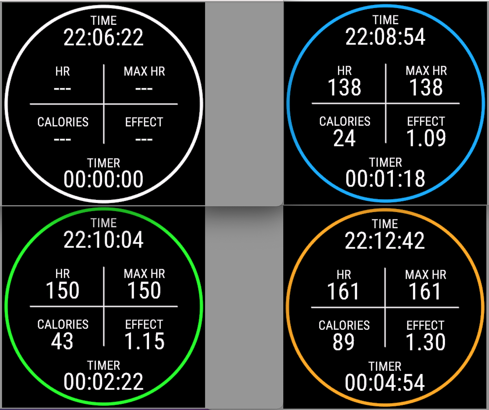

# anySport

## Record any Sport
Different sports can be recorded with this app. Not every value is displayed in the Garmin Connect IQ app for every selected sport. 
With the help of the Fit Contributor, additional values can be transmitted to the Connect app.

- FitContributor need to be add.
- Change kind of Sport needs to be add to properties.

## Record Sport on Venu2 with an simple View

## Build App for use

Follow Programmer's Guide to setup your Windows or Mac.

Download Garmin Connect IQ SDK Manager.

Use the SDK manager to download the latest Connect IQ SDK and devices.

Once the download completes, click Yes when prompted to use the new SDK version as your active SDK.

Close the SDK Manager.

Install under Visual Studio Code the Monkey C Extension.

In VS Code, click Ctrl + Shift + P (Command + Shift + P on Mac) and select "Monkey C: build for device".
- Select were the .prg fiel should be stored.
- Choose Debig or Release (I am using debug).

Connect your device (Edge 130) with data cable to you PC/Mac and move the .prg file under APPS.

## Useful Documentation

https://developer.garmin.com/connect-iq/programmers-guide/

https://developer.garmin.com/downloads/connect-iq/monkey-c/doc/Toybox.html

https://developer.garmin.com/connect-iq/compatible-devices/
